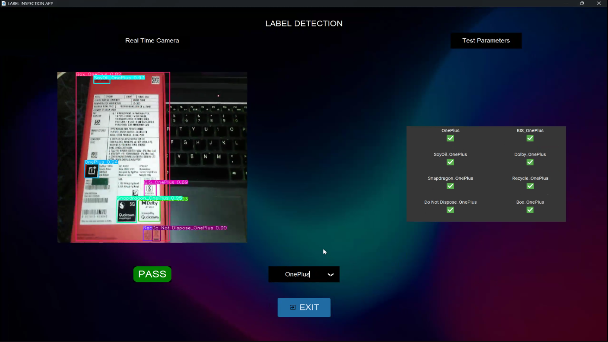
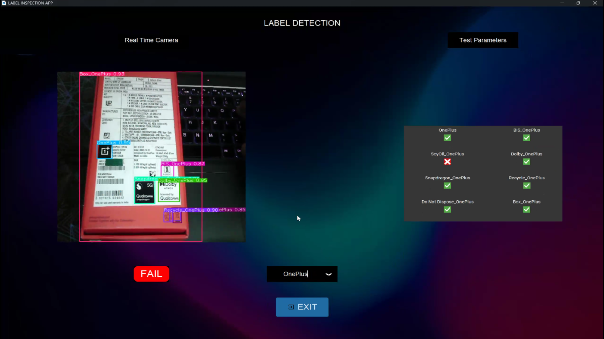

# 🏷️ LabelLens - ML-Powered Label Inspection using Image Recognition

LabelLens is a real-time label detection application using YOLOv5 for image recognition. It detects product labels, such as Samsung and OnePlus, in camera feeds and provides immediate feedback on the results.

---

## 📖 Overview

LabelLens uses a real-time camera feed to detect product labels with YOLOv5. The app supports multiple brands and displays a pass or fail result based on label detection accuracy.

---

## 🛠️ Key Features
- **Real-Time Label Detection:** Detects labels instantly in the camera feed.
- **Multi-Brand Support:** Supports Samsung, OnePlus, and more.
- **Instant Feedback:** Shows pass or fail results in real-time.
- **Interactive UI:** Easily switch between label categories.
- **Responsive UI:** Adapts to different screen sizes using `customtkinter`.

---

## ⚙️ Tech Stack
- **Python:** For development and compatibility.
- **YOLOv5 (PyTorch):** Real-time object detection model.
- **OpenCV:** Handles video feed and frame processing.
- **customtkinter:** Modern UI framework.
- **PIL:** Image processing and conversion.
- **NumPy:** Numerical operations for image data.
- **Requests:** Used for network operations.

---

## 🖼️ **Project Demo**  
👉 Screenshots of the GUI application are provided below:

  

 

---
## 📥 Installation and Usage

Follow these steps to install and set up the LabelLens app on your system:

### Prerequisites

Before installing, make sure you have the following installed:
- Python 3.8 or above
- pip (Python's package installer)
- Git (to clone the repository)

### Steps to Install

1. **Clone the repository:**

   ```bash
   git clone https://github.com/Tharun151425/LabelLens-Label_Detection.git
   cd LabelLens-Label_Detection
   ```
2. Create a virtual environment (optional but recommended):
    ```
    python3 -m venv venv
    source venv/bin/activate   # For Linux/Mac
    venv\Scripts\activate      # For Windows
    ```
3. Install dependencies:
    Install the required Python libraries using pip:
   ```
   pip install -r requirements.txt
   ```
4. Download the YOLOv5 model weights:
    The YOLOv5 model weights are required for label detection. You can download them from the provided location or place them directly in the weights/ directory.
   ```
   mkdir weights
    # Download the YOLOv5 model weights and place it in the weights directory
   ```
5 . Running the Application
    Once the installation is complete, you can use the LabelLens app by running the following command:
   ```
    python app.py
   ```

---

## Files 📂

- **app.py:** Main Python script to run the application.
- **requirements.txt:** Contains all necessary libraries to run the project.
- **weights/last.pt:** Pre-trained YOLOv5 model weights (ensure this file is present in the `weights/` directory).
- **images:** Folder containing images for the background, check and cross icons, exit button, etc.

---

## 🤝 Collaborators
This project is open for collaboration! Feel free to fork the repository, contribute, and help enhance the LabelLens project.

### Current Collaborators:

- **Tharun Krishna M** - [GitHub Profile](https://github.com/Tharun151425)
- **Yeshas Raju** - [GitHub Profile](https://github.com/YeshasRaju))

### How to Contribute:

1. Fork the repository.
2. Create a new branch (`git checkout -b feature-name`).
3. Make your changes and commit them (`git commit -am 'Add new feature'`).
4. Push to your branch (`git push origin feature-name`).
5. Open a pull request.
6. Your contribution will be reviewed and merged if accepted.

Feel free to add issues or feature requests if you encounter any bugs or need additional functionality!

---
## 📬 Contact Me

If you have any questions, suggestions, or just want to connect, feel free to reach out!

- 📧 **Email**: [tharun151425@gmail.com](mailto:tharun151425@gmail.com)
- 🔗 **LinkedIn**: [Tharun Krishna M](https://www.linkedin.com/in/tharunkrishna-m/)
- 🧑‍💻 **GitHub**: [Tharun151425](https://github.com/Tharun151425)
- 💻 **LeetCode**: [Tharun151425](https://leetcode.com/u/tharun151425/)

I'm always open to discussing ideas, potential collaborations, or new opportunities. Don’t hesitate to get in touch!

---
